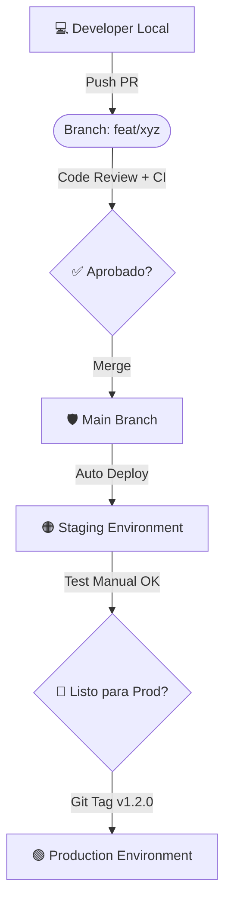

```mermaid
flowchart TD
    Dev[💻 Developer Local] -->|Push PR| Feat([Branch: feat/xyz])
    Feat -->|Code Review + CI| Appr{✅ Aprobado?}
    Appr -->|Merge| Main[🛡️ Main Branch]
    Main -->|Auto Deploy| Stg[🟠 Staging Environment]
    Stg -->|Test Manual OK| ProdReady{🚀 Listo para Prod?}
    ProdReady -->|Git Tag v1.2.0| Prod[🟢 Production Environment]
```

