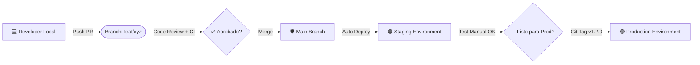

## 2. Flujo de Trabajo (Workflow)

### Arquitectura de Ramas y Entornos

<table>
  <tr>
    <td width="50%">

</td>
<td width="50%">

1. **Local**: Tu entorno de desarrollo.
2. **Pull Request (PR)**: Validación de código obligatoria.
3. **Main**: La verdad absoluta del código.
4. **Staging**: Copia fiel de producción para pruebas finales (se actualiza con cada merge a main).
5. **Production**: Donde viven los usuarios (se actualiza solo al crear un Tag).
</td>

</tr>
</table>

---

